# Nitoll Waat

> *Konkani for "Take it Away"* — An IoT + AI-powered smart waste management system built at a hackathon organised by **GDG (Google Developer Group)**.

Goa's waste collection follows static, fixed-frequency routes — trucks run the same path daily regardless of actual bin fill levels. Nitoll Waat replaces this with a demand-driven system: sensor-equipped bins report fill levels in real time, an AI engine predicts overflows and detects sensor blockages, and a route optimiser generates daily collection paths covering only the bins that actually need service.

---

## Problem Statement

**Track 3: Smart Waste — Demand-Driven Logistics**

Goa's garbage trucks follow the same route every day, regardless of whether a bin is empty or overflowing. In tourist hubs like Calangute, bins overflow in 2 hours, while in quiet villages, trucks waste fuel visiting near-empty bins. This is inefficient, costly, and unhygienic.

**The Challenge:** Build a Dynamic Logistics Engine for waste management that solves:

| Sub-Problem | Description |
|---|---|
| **Fill-Level Paradox** | Sensors must distinguish between a "full bin" and a "blocked sensor" (e.g., a cardboard box stuck at the top). |
| **Route Optimisation** | Generate a new route each morning based only on bins that are >80% full. |
| **Tourist Spike Alert** | Predict when a bin will become full based on real-time filling speed (e.g., "filling at 10%/hr → overflow by 4:00 PM"). |

---

## Architecture



The system follows a four-layer architecture:

1. **Hardware Layer** — ESP8266 microcontroller reads VL53L0X (Time-of-Flight distance), HX711 + load cell (weight), and potentiometer (lid angle). Sensor data is transmitted over Wi-Fi to the backend.
2. **Backend Layer** — Node.js + Express server with PostgreSQL. Receives sensor readings via REST, pushes real-time updates over Socket.IO, and runs the AI engines (prediction, routing, anomaly detection).
3. **Web Dashboard** — React (TypeScript) + Vite admin panel with Leaflet maps for bin locations and ApexCharts/Recharts for analytics. Admins manage bins, wards, drivers, and monitor the fleet.
4. **Mobile App** — Android (Java/Kotlin) driver app that receives optimised routes and turn-by-turn navigation via Firebase Cloud Messaging push notifications.

---

## Flowchart



**Data flow summary:**

1. Sensors read fill level, weight, and lid angle → ESP8266 transmits to backend.
2. Backend validates readings and persists to PostgreSQL.
3. **Anomaly Detector** cross-references fill vs. weight — if fill spikes but weight doesn't change, it flags a blocked sensor (not a full bin).
4. **Prediction Engine** analyses historical fill-rate data to forecast overflow times with confidence scoring.
5. **Route Engine** uses a Nearest Neighbor algorithm with priority-weighted scoring (bin urgency × travel distance) to generate optimised collection routes.
6. Dashboard and mobile app consume the processed data in real time via Socket.IO.

---

## Project Structure

```text
Nitoll_Waat/
├── Backend_Server/          # Node.js + Express API server
│   └── src/
│       ├── controllers/     # Route handlers (bin, fleet, auth, analytics, etc.)
│       ├── services/        # Core AI engines
│       │   ├── predictionEngine.js    # Overflow time forecasting
│       │   ├── routeEngine.js         # Nearest Neighbor route optimisation
│       │   ├── boundaryValidator.js   # Geofence / ward boundary checks
│       │   └── notificationService.js # FCM push notifications
│       ├── routes/          # Express route definitions
│       ├── middleware/      # JWT auth, RBAC
│       └── config/          # DB connection, env
├── UI_website/              # React + Vite admin dashboard & public portal
│   └── src/
├── UI_App/                  # Android driver app (Java/Kotlin)
│   └── app/
├── Hardware/                # ESP8266 firmware (Arduino C++)
│   └── Esp.txt
├── Architecture.svg         # System architecture diagram
├── Flowchart.svg            # Data flow diagram
└── IMAGE/                   # Screenshots and demo photos
```

---

## Technology Stack

### Backend
- **Runtime**: Node.js
- **Framework**: Express.js (v5.x)
- **Database**: PostgreSQL
- **Real-time**: Socket.io for live bin and vehicle tracking
- **Notifications**: Firebase Cloud Messaging (FCM) & Nodemailer
- **Security**: JWT Authentication, Bcrypt hashing, Helmet.js

### Admin Dashboard & Public Portal (Website)
- **Framework**: React 19 (Vite + TypeScript)
- **Mapping**: Leaflet.js (React-Leaflet) for geospatial bin visualization
- **Analytics**: ApexCharts & Recharts for waste generation trends
- **Icons**: Lucide React
- **State Management**: Context API

### Mobile Application
- **Platform**: Native Android
- **Language**: Java/Kotlin
- **Features**: Real-time route tracking, FCM Push Notifications, Collection confirmation

### Hardware
- **Microcontroller**: ESP8266 (NodeMCU)
- **Sensors**: 
  - **VL53L0X**: Time-of-Flight (ToF) sensor for precise fill-level measurement.
  - **HX711 + Load Cell**: For monitoring the weight of the waste.
  - **Potentiometer**: For detecting lid angle and status (Open/Closed/Jammed).
- **Protocol**: HTTP/REST for data reporting.

---

## Key Features

- **Real-time Monitoring**: Track bin fill levels, weight, and lid status across different wards and areas via live Socket.io updates.
- **Automated Alerts**: Instant notifications (FCM & Email) when bins are full, blocked, or if the lid is jammed.
- **Route Optimization**: Automated generation of collection routes based on bin status and proximity.
- **Public Complaint System**: Citizens can report overflowing bins or missed collections directly through the portal.
- **Vehicle Management**: Track the status, type (Compactors, Tippers, etc.), and assignment of the collection fleet.
- **Detailed Analytics**: Heatmaps and charts showing waste collection efficiency and area-wise performance.

---

## Getting Started

### Prerequisites
- Node.js (v18+)
- PostgreSQL (v15+)
- Arduino IDE (for ESP8266)
- Android Studio (for Mobile App)

### Installation

1.  **Database Setup**:
    ```bash
    psql -U your_user -d your_db -f current_schema.sql
    ```

2.  **Backend Configuration**:
    Create a `.env` file in `Backend_Server/`:
    ```env
    PORT=5000
    DB_USER=your_user
    DB_HOST=localhost
    DB_NAME=nitoll_waat
    DB_PASSWORD=your_password
    DB_PORT=5432
    JWT_SECRET=your_jwt_secret
    FIREBASE_SERVICE_ACCOUNT_PATH=./path/to/firebase-key.json
    EMAIL_USER=your_email@gmail.com
    EMAIL_PASS=your_app_password
    ```
    ```bash
    cd Backend_Server
    npm install
    ```

3.  **Seed Data (Optional)**:
    To populate your database with demo drivers, vehicles, and 7 days of reading history:
    ```bash
    # 1. Add required Enum values if missing
    node src/fix_enum.js

    # 2. Seed Drivers, Wards, and Vehicles
    node src/seed_drivers.js

    # 3. Backfill bin reading history
    node src/seed_readings.js
    ```
    You can then login to the Admin Dashboard with:
    - **Email**: `driver@demo.com`
    - **Password**: `password123`

4.  **Run Backend**:
    ```bash
    npm run dev
    ```

5.  **Admin Website**:
    ```bash
    cd ../UI_website
    npm install
    npm run dev
    ```

6.  **Hardware**:
    - Open `Hardware/Esp.txt` in Arduino IDE.
    - Install required libraries: `HX711_ADC`, `Adafruit_VL53L0X`, `ESPAsyncWebServer`, `ESPAsyncTCP`.
    - Update WiFi credentials (`ssid`, `password`) and `serverUrl` in the code.
    - Upload to NodeMCU.

---

## Team

| Name | Program |
|---|---|
| Aakansha Sawant | MCA |
| Anish Ghadi | MCA |
| Apa Mestry | MCA |
| Prachi Gaonkar | MSc AI |
| Saini Haldankar | MSc Data Science |
| Sherine Travasso | MCA |
| Shreyash Vaingankar | MCA |

---

## License

This project is licensed under the ISC License.
